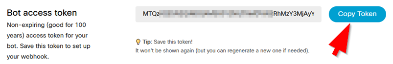

# MV Snapshotter

Cisco Webex (formerly known as Webex Teams) is used for collaboration in many organizations. If
you're a Webex user it just makes sense to bring your important MV notifications into the app.
Even if you're not a Webex user, this will work with a free account.

Envisioned to allow external event triggers to snapshot retrieval and snapshot posting, when the 
external system is capable of performing only simple actions (eg. make an HTTP request). Even
"dumber" systems could trigger events using contact closure sensors/relays.

Some example scenarios:
- Panic button is pressed, triggering alert and snapshot posting to security response space
- Door is unexpectedly opened
- Badge reader / physical access control integration
- Person Detected (in conjunction with MV Sense)
- Doorbell / buzzer is pressed
- Scheduled (eg. for quality control or routine checks)

Setup Instructions:
1. If not already using Webex, sign up for an account at https://teams.webex.com. Enter your email
address and if you don't have an account and your domain name is an enterprise customer already, you
will receive an email to activate your account. Activate it, set a password, set your display name. 
Click on Try Messaging to begin. 

2. Create a bot account at https://developer.webex.com. You'll have to sign in using your user account
(that you set up in step 1 if not already on the platform.) Click on the link for Bots or otherwise
create a new bot at https://developer.webex.com/my-apps/new/bot. It will require a globally unique
username. Upload a cool icon, or use one of the defaults.  Take note of the username 
(your_bot_name@webex.bot) as well as the Bot API access token.



3. Create a space that you will use for your notifications. You'll probably want to install the mobile 
and/or desktop client(s) on your devices. Once in the app with a space created, invite your bot from 
step 2 to the space using the three-dot menu in the space. Alternatively, you can use a 1:1 (direct)
space if preferred.

4. Log in to your Meraki Dashboard as an Org admin. Create a dedicated API service account (not strictly
required but it's a good idea.) Grant this account access to only the network(s) required. Full access
is required to use the Snapshot API, read-only is not sufficient. Service accounts require a valid email
address. A handy way to manage this is to use a subaddress by adding +api to the user portion of your
valid email address. eg. user+api@domain.com. 

Log into Dashboard using the new account (use a different browser or private browsing session.) 
Enable API access in your user profile and securely store your API key. Find your Meraki organization
ID. There are multiple ways to find this, but the easiest is to navigate to 
https://dashboard.meraki.com/api/v0/organizations while logged in as your API service account.

5. In the config directory create a config.ini from the sample provided.  Enter the Meraki API key and
Org ID as well as the serial number for your desired Meraki MV smart camera. Also supply your Webex 
bot token. The room_name can be either a group/space name or an individual name.
   
6. Install the required packages using pip
```buildoutcfg
pip install -r requirements.txt
```

## Test
Test your installation at this point by running the application directly:
```
python mvSnapshotter.py
```
This should pull a snapshot and post to your desired Webex space. 

## Install and use the API gateway component
The Flask web framework for Python is used to optionally invoke execution remotely, using an HTTP call.
This is intended to make it simple for a building automation platform to request a snapshot. 

As the risk exposure of this APIgw is limited to spamming of snapshots, a minimal and simple auth
mechanism is implemented to ensure other 'simple' systems (eg. IoT devices) have little fuss making
the HTTP request. Generate some sort of an auth string of your choosing and enter it in config.ini.
Call the web service using a GET request to 

```http://[apigw]:[port]/api/v1.0/getSnapshot?apikey=abc123```

If desired, A different camera serial number and/or room name can be specified when making the request to 
override the one configured in config.ini. Can be supplied in the POST body or as a GET parameter.

```http://[apigw]:[port]/api/v1.0/getSnapshot?apikey=abc123?&mvSerial=Q2JV-1ABC-1A1A,Q2JV-AB2C-ABCD&webexRoom=Priority Notifications```

or the same URL can be called as a POST with the apikey provided in the body. Making the call as a HTTP
POST would have a body as follows:
```buildoutcfg
{
    "apikey": "d5358c65363328df01b61ce5",
    "mvSerial": "Q2JV-1ABC-1A1A,Q2JV-AB2C-ABC",
    "webexRoom": "Priority Alerts"
}
```

You can run the apigw component on demand from the command line:
```python mvSnapshotter_apigw.py```

If running as a service you'll want to install appropriate startup scripts for your environment. 
This varies by system and personal preference but step-by-step install is illustrated below for
Raspberry pi and Ubuntu Linux. A sample local rc file for Slackware Linux is also provided. 

Raspberry pi & Ubuntu (tested on buster & 20.04.2.0 LTS) step-by-step setup:
```
sudo apt update
sudo apt upgrade
sudo apt install git python3-pip
cd /usr/local
sudo git clone http://github.com/rylatorr/mvSnapshotter
sudo chown -R [your unprivileged user acct] mvSnapshotter
cd mvSnapshotter
sudo pip3 install -r requirements.txt
cd config
cp config-sample.ini config.ini
vi config.ini # (or pico. Edit)
cd ..
python3 mvSnapshotter.py # one-time test execution
python3 mvSnapshotter_apigw.py # test HTTP gateway, then ctrl-c
sudo cp init.d/mvSnapshotter_apigw /etc/init.d
sudo chmod +x /etc/init.d/mvSnapshotter_apigw
sudo update-rc.d mvSnapshotter_apigw defaults
sudo service mvSnapshotter_apigw start
sudo systemctl status mvSnapshotter_apigw.service # used to check status
```
